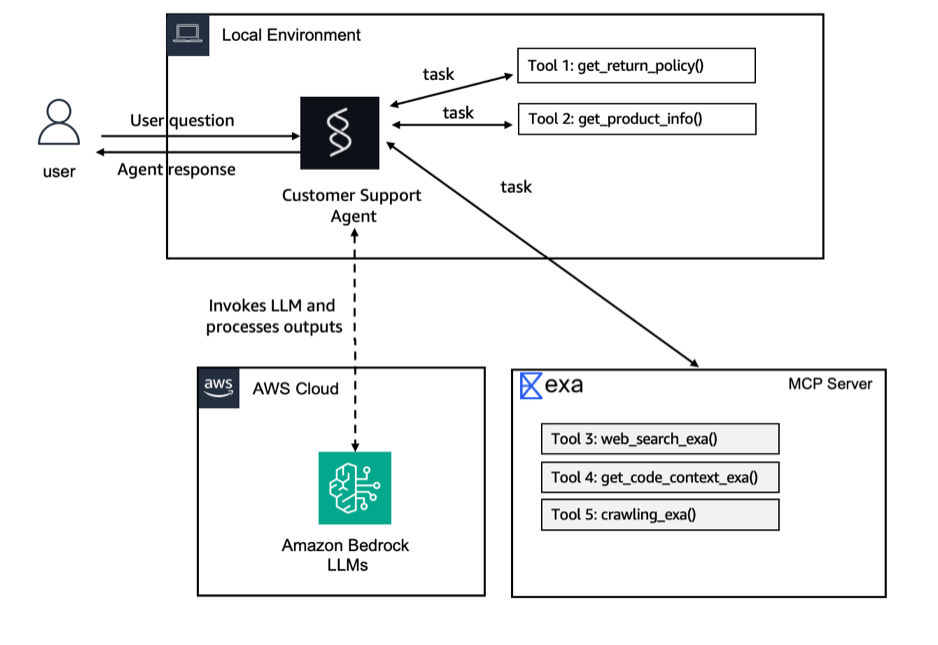

# Lab 1: Building the Agent Prototype

⏱️ **Estimated time:** ~20 minutes

## Overview

In this lab, you will build a customer support AI agent using **Amazon Bedrock AgentCore**, the **Strands Agents SDK**, and **Amazon Bedrock**.

The agent will be able to:

- Answer product-related questions
- Look up return policies
- Search product information
- Search the web for troubleshooting help using Exa AI through MCP
- Run locally using AgentCore Dev
- Deploy to Amazon Bedrock AgentCore Runtime
- Invoke the deployed agent from the command line

By the end of this lab, your agent will be running in **AgentCore Runtime** and accessible with:

```bash
agentcore invoke "What can you do?"
```

---

# Architecture

During local development, the architecture looks like this:

```text
User
  |
  v
AgentCore Dev
  |
  v
Strands Agent
  |
  +-----------------------+
  |                       |
  v                       v
Custom Python Tools     MCP Client
  |                       |
  |                       v
  |                    Exa AI
  |
  +--> Product Information
  |
  +--> Return Policies
  |
  v
Amazon Bedrock
Claude Sonnet 4.6
```

After deployment:

```text
User / CLI
    |
    v
agentcore invoke
    |
    v
Amazon Bedrock AgentCore Runtime
    |
    v
Strands Agent
    |
    +------------------------+
    |                        |
    v                        v
Custom Tools              MCP Client
    |                        |
    v                        v
Product / Policy Data     Exa AI Web Search
    |
    v
Amazon Bedrock
Claude Sonnet 4.6
```
### Local Architecture

At this point, your local architecture looks like this: an agent with two custom tools and an MCP-connected web search, all running on your machine.


---

# Step 1: Create the Project

Open the Code Editor terminal:

- **Windows/Linux:** `Ctrl + \``
- Or select **View → Terminal**

Run:

```bash
agentcore create \
  --name CustomerSupport \
  --framework Strands \
  --model-provider Bedrock \
  --memory none
```

You should see output similar to:

```text
[done]  Create CustomerSupport/ project directory
[done]  Prepare agentcore/ directory
[done]  Initialize git repository
[done]  Add agent to project
[done]  Set up Python environment

Created:
  CustomerSupport/
    app/CustomerSupport/  Python agent (Strands)
    agentcore/            Config and CDK project

Project created successfully!
```

Move into the new project directory:

```bash
cd CustomerSupport
```

All remaining commands in this lab should be run from this directory.

---

# Step 2: Explore the Project Structure

The generated project should look similar to:

```text
CustomerSupport/
├── AGENTS.md
├── README.md
├── agentcore/
│   ├── agentcore.json
│   ├── aws-targets.json
│   ├── .env.local
│   ├── .cli/
│   │   └── deployed-state.json
│   ├── .llm-context/
│   └── cdk/
└── app/
    └── CustomerSupport/
        ├── main.py
        ├── model/
        │   └── load.py
        ├── mcp_client/
        │   └── client.py
        └── pyproject.toml
```

## Important Files

### `app/CustomerSupport/main.py`

The main agent entry point.

It contains:

- Strands Agent configuration
- System prompt
- AgentCore Runtime application
- Custom tools
- MCP client configuration
- Agent invocation logic

### `app/CustomerSupport/model/load.py`

Defines the Amazon Bedrock model used by the agent.

In this lab, we will explicitly configure:

```text
Claude Sonnet 4.6
```

### `agentcore/agentcore.json`

Main AgentCore project configuration.

It defines resources such as:

- Agents
- Runtime configuration
- Credentials
- Memory
- Other AgentCore resources

### `agentcore/cdk/`

Contains AWS CDK infrastructure used during deployment.

### `agentcore/.env.local`

Stores local environment variables and credentials.

This file should normally be excluded from Git.

---

# Step 3: Customize the Customer Support Agent

Open:

```text
app/CustomerSupport/main.py
```

Replace the entire file with the following code:

```python
from strands import Agent, tool
from bedrock_agentcore.runtime import BedrockAgentCoreApp
from model.load import load_model
from mcp_client.client import get_streamable_http_mcp_client

app = BedrockAgentCoreApp()
log = app.logger

# Exa AI MCP client for web search
mcp_clients = [get_streamable_http_mcp_client()]

# --- Customer Support Tools ---

RETURN_POLICIES = {
    "electronics": {"window": "30 days", "condition": "Original packaging required, must be unused or defective", "refund": "Full refund to original payment method"},
    "accessories": {"window": "14 days", "condition": "Must be in original packaging, unused", "refund": "Store credit or exchange"},
    "audio": {"window": "30 days", "condition": "Defective items only after 15 days", "refund": "Full refund within 15 days, replacement after"},
}

PRODUCTS = {
    "PROD-001": {"name": "Wireless Headphones", "price": 79.99, "category": "audio", "description": "Noise-cancelling Bluetooth headphones with 30h battery life", "warranty_months": 12},
    "PROD-002": {"name": "Smart Watch", "price": 249.99, "category": "electronics", "description": "Fitness tracker with heart rate monitor, GPS, and 5-day battery", "warranty_months": 24},
    "PROD-003": {"name": "Laptop Stand", "price": 39.99, "category": "accessories", "description": "Adjustable aluminum laptop stand for ergonomic desk setup", "warranty_months": 6},
    "PROD-004": {"name": "USB-C Hub", "price": 54.99, "category": "accessories", "description": "7-in-1 USB-C hub with HDMI, USB-A, SD card reader, and ethernet", "warranty_months": 12},
    "PROD-005": {"name": "Mechanical Keyboard", "price": 129.99, "category": "electronics", "description": "RGB mechanical keyboard with Cherry MX switches", "warranty_months": 24},
}

@tool
def get_return_policy(product_category: str) -> str:
    """Get return policy information for a specific product category.

    Args:
        product_category: Product category (e.g., 'electronics', 'accessories', 'audio')

    Returns:
        Formatted return policy details including timeframes and conditions
    """
    category = product_category.lower()
    if category in RETURN_POLICIES:
        policy = RETURN_POLICIES[category]
        return f"Return policy for {category}: Window: {policy['window']}, Condition: {policy['condition']}, Refund: {policy['refund']}"
    return f"No specific return policy found for '{product_category}'. Please contact support for details."

@tool
def get_product_info(query: str) -> str:
    """Search for product information by name, ID, or keyword.

    Args:
        query: Product name, ID (e.g., 'PROD-001'), or search keyword

    Returns:
        Product details including name, price, category, and description
    """
    query_lower = query.lower()
    # Search by ID
    if query.upper() in PRODUCTS:
        p = PRODUCTS[query.upper()]
        return f"{p['name']} ({query.upper()}): ${p['price']}, Category: {p['category']}, {p['description']}, Warranty: {p['warranty_months']} months"
    # Search by keyword
    results = [f"{pid}: {p['name']} - ${p['price']} - {p['description']}" for pid, p in PRODUCTS.items()
               if query_lower in p['name'].lower() or query_lower in p['description'].lower() or query_lower in p['category'].lower()]
    if results:
        return "Found products:\n" + "\n".join(results)
    return f"No products found matching '{query}'."

tools = [get_return_policy, get_product_info]

# Add MCP client (Exa AI web search) to tools
for mcp_client in mcp_clients:
    if mcp_client:
        tools.append(mcp_client)

# --- Agent Setup ---

_agent = None

def get_or_create_agent():
    global _agent
    if _agent is None:
        _agent = Agent(
            model=load_model(),
            system_prompt="""You are a helpful and professional customer support assistant for an e-commerce company.
Your role is to:
- Provide accurate information using the tools available to you
- Be friendly, patient, and understanding with customers
- Always offer additional help after answering questions
- If you can't help with something, direct customers to the appropriate contact

You have access to tools for looking up return policies, searching product information, and more.
Additional tools may be available at runtime — always check your full tool list and use the most appropriate tool for each customer request.
Always use tools to get accurate, up-to-date information rather than guessing.""",
            tools=tools
        )
    return _agent


@app.entrypoint
async def invoke(payload, context):
    log.info("Invoking Agent.....")
    agent = get_or_create_agent()
    stream = agent.stream_async(payload.get("prompt"))
    async for event in stream:
        if "data" in event and isinstance(event["data"], str):
            yield event["data"]


if __name__ == "__main__":
    app.run()
```

Save the file.

---

# Verify `main.py`

Run:

```bash
python3 -c "import ast; ast.parse(open('app/CustomerSupport/main.py').read()); print('OK: parses')"

grep -c 'def get_return_policy\|def get_product_info\|def invoke\|def get_or_create_agent' app/CustomerSupport/main.py

grep -c 'add_numbers' app/CustomerSupport/main.py

wc -l app/CustomerSupport/main.py
```

Expected key output:

```text
OK: parses
4
0
107 app/CustomerSupport/main.py
```

The exact line count can vary depending on formatting.

This confirms:

- Python syntax is valid
- All four important functions exist
- The old `add_numbers` sample tool is gone

---

# Pin the Amazon Bedrock Model

Open:

```text
app/CustomerSupport/model/load.py
```

Replace the contents with:

```python
from strands.models.bedrock import BedrockModel


def load_model() -> BedrockModel:
    """Get Bedrock model client using IAM credentials."""
    return BedrockModel(model_id="global.anthropic.claude-sonnet-4-6")
```

Save the file.

---

# Verify the Model Configuration

Run:

```bash
python3 -c "import ast; ast.parse(open('app/CustomerSupport/model/load.py').read()); print('OK: parses')"

grep -c 'claude-sonnet-4-6' app/CustomerSupport/model/load.py
```

Expected output:

```text
OK: parses
1
```

---

# Why Pin the Model?

The model ID used in this lab is:

```text
global.anthropic.claude-sonnet-4-6
```

The `global.` prefix represents a Bedrock cross-region inference profile.

This allows Amazon Bedrock to route requests to available supported regions, improving:

- Throughput
- Availability
- Resilience

Claude Sonnet 4.6 model IDs do not use a date suffix in this configuration.

For example, avoid using an ID such as:

```text
...claude-sonnet-4-6-20250514-v1:0
```

Labs 2 through 4 can reuse the same `load_model()` function, so configuring the model once here keeps the workshop consistent.

---

# Step 4: Start the Local Development Server

Start the AgentCore development server:

```bash
agentcore dev --no-browser
```

This option is recommended when running inside the AWS-provided VS Code Server.

The local development environment provides:

- Hot reload
- Interactive terminal UI
- Local agent execution
- Fast development feedback

## Important: `--no-browser` Still Requires a Terminal

The command:

```bash
agentcore dev --no-browser
```

still requires an interactive terminal.

It changes the interface from the web Inspector to a terminal-based UI.

For scripts or non-interactive environments, use:

```bash
agentcore dev -l
```

Then send prompts separately with:

```bash
agentcore dev "Your prompt"
```

---

# Step 5: Test the Agent

## Test 1: Return Policy

Enter:

```text
What's the return policy for electronics?
```

Expected behavior:

```text
get_return_policy("electronics")
```

The agent should return:

- 30-day return window
- Packaging/condition requirements
- Refund information

---

## Test 2: Product Information

Enter:

```text
Tell me about the Wireless Headphones
```

Expected behavior:

```text
get_product_info("headphones")
```

The agent should return:

- Product name
- Price
- Product category
- Product description
- Warranty

---

## Test 3: MCP Web Search

Enter:

```text
Search for common Bluetooth headphone troubleshooting tips
```

Expected behavior:

The agent should use the **Exa AI MCP client** to search the web.

---

## Test 4: Multi-Tool Query

Enter:

```text
I bought a Smart Watch (PROD-002) and want to return it.
What's the return policy?
```

Expected behavior:

The agent should first call:

```text
get_product_info("PROD-002")
```

It should determine that the Smart Watch belongs to:

```text
electronics
```

Then it should call:

```text
get_return_policy("electronics")
```

This demonstrates **multi-tool reasoning**.

---

# Stop the Development Server

When testing is complete, press:

```text
Ctrl+C
```

If you are inside the interactive terminal UI, `Esc` may also exit the UI.

---

# First-Time Amazon Bedrock Verification

When using a new AWS account for the first time, Amazon Bedrock may return an error similar to:

```text
AccessDeniedException:
Your account is currently being verified.
```

If this happens:

1. Retry later.
2. Confirm the AWS account has access to the required Bedrock model.
3. Verify IAM permissions.
4. Follow the AWS verification instructions shown in the error.

AWS event-provided accounts may already be configured.

---

# Step 6: Deploy the Agent to AWS

Deploy the agent:

```bash
agentcore deploy
```

The AgentCore CLI handles tasks such as:

- Validating the project
- Packaging the application
- Building CDK infrastructure
- Synthesizing CloudFormation
- Creating IAM roles
- Publishing assets
- Deploying the AgentCore Runtime

---

# CDK Bootstrap

When using a fresh AWS account, the CLI may ask you to bootstrap AWS CDK.

If prompted, approve the bootstrap.

This creates the required:

```text
CDKToolkit
```

CloudFormation stack.

AWS workshop/event accounts may already be bootstrapped.

---

# Check Deployment Status

Run:

```bash
agentcore status
```

Wait until the runtime status shows:

```text
READY
```

---

# Invoke the Cloud Agent

After deployment, run:

```bash
agentcore invoke "What can you do?"
```

You can also test:

```bash
agentcore invoke "What's the return policy for electronics?"
```

```bash
agentcore invoke "Tell me about PROD-002"
```

```bash
agentcore invoke "Search for Bluetooth headphone troubleshooting tips"
```

---

# AWS Console

You can view the deployed runtime in the AWS Console under:

```text
Amazon Bedrock
    ↓
AgentCore
    ↓
Runtimes
```

The runtime should show:

```text
Ready
```

---

# What Just Happened?

## 1. `agentcore create`

```bash
agentcore create
```

This created:

- AgentCore project structure
- Python Strands agent
- MCP client
- Python environment
- CDK infrastructure
- Git repository
- AgentCore configuration

## 2. Custom Agent Tools

You replaced the generated sample tool with two customer support tools:

```python
get_return_policy()
```

and:

```python
get_product_info()
```

## 3. MCP Web Search

The agent also connects to an MCP server using:

```python
get_streamable_http_mcp_client()
```

This gives the agent access to Exa AI web search.

## 4. `agentcore dev`

```bash
agentcore dev --no-browser
```

This provides:

- Hot reload
- Agent execution
- Interactive testing
- Fast iteration

## 5. `agentcore deploy`

```bash
agentcore deploy
```

This packages and deploys the agent to AWS.

## 6. `agentcore invoke`

```bash
agentcore invoke "What can you do?"
```

This sends a request to the deployed AgentCore Runtime.

---

# Agent Tool Flow

```text
User Question
     |
     v
CustomerSupport Agent
     |
     v
LLM decides whether tools are required
     |
     +---------------------------+
     |                           |
     v                           v
get_product_info()       get_return_policy()
     |
     +---------------------------+
     |
     v
Optional MCP Web Search
     |
     v
Claude Sonnet 4.6
     |
     v
Final Response
```

---

# Example Product Data

| Product ID | Product | Price | Category | Warranty |
|---|---|---:|---|---:|
| PROD-001 | Wireless Headphones | $79.99 | Audio | 12 months |
| PROD-002 | Smart Watch | $249.99 | Electronics | 24 months |
| PROD-003 | Laptop Stand | $39.99 | Accessories | 6 months |
| PROD-004 | USB-C Hub | $54.99 | Accessories | 12 months |
| PROD-005 | Mechanical Keyboard | $129.99 | Electronics | 24 months |

---

# Example Return Policies

| Category | Return Window | Refund |
|---|---|---|
| Electronics | 30 days | Full refund to original payment method |
| Accessories | 14 days | Store credit or exchange |
| Audio | 30 days | Full refund within 15 days, replacement after |

---

# Important Commands

## Create Project

```bash
agentcore create \
  --name CustomerSupport \
  --framework Strands \
  --model-provider Bedrock \
  --memory none
```

## Enter Project

```bash
cd CustomerSupport
```

## Validate Python

```bash
python3 -c "import ast; ast.parse(open('app/CustomerSupport/main.py').read()); print('OK: parses')"
```

## Start Development Server

```bash
agentcore dev --no-browser
```

## Deploy

```bash
agentcore deploy
```

## Check Status

```bash
agentcore status
```

## Invoke Agent

```bash
agentcore invoke "What can you do?"
```

---

# Troubleshooting

## Python Syntax Error

Run:

```bash
python3 -c "import ast; ast.parse(open('app/CustomerSupport/main.py').read()); print('OK: parses')"
```

If this fails, inspect:

```text
app/CustomerSupport/main.py
```

for copy/paste or indentation problems.

## Old Sample Tool Still Exists

Run:

```bash
grep -c 'add_numbers' app/CustomerSupport/main.py
```

Expected:

```text
0
```

## Model Configuration Is Wrong

Run:

```bash
grep -c 'claude-sonnet-4-6' app/CustomerSupport/model/load.py
```

Expected:

```text
1
```

## AgentCore Dev Requires Interactive Terminal

If:

```bash
agentcore dev --no-browser
```

fails with:

```text
Error: This command requires an interactive terminal
```

use:

```bash
agentcore dev -l
```

for non-interactive execution.

## Deployment Not Ready

Check:

```bash
agentcore status
```

The runtime must reach:

```text
READY
```

before invoking the cloud-deployed agent.

---
### Updated Architecture

Your agent is no longer running on your local machine. It is now deployed to **AgentCore Runtime** in AWS and accessible through a managed endpoint.


# Skills Learned

After completing this lab, you should understand:

- Amazon Bedrock AgentCore basics
- AgentCore CLI
- AgentCore Runtime
- Strands Agents SDK
- Amazon Bedrock model integration
- Claude Sonnet 4.6 configuration
- Python tool creation
- Tool calling
- Multi-tool agent workflows
- MCP integration
- Exa AI web search
- Local agent development
- Agent deployment to AWS
- Cloud agent invocation

---

# Lab Completion Checklist

- [ ] Created the `CustomerSupport` AgentCore project
- [ ] Reviewed the generated project structure
- [ ] Replaced the sample `add_numbers` tool
- [ ] Added `get_return_policy`
- [ ] Added `get_product_info`
- [ ] Configured the Exa AI MCP client
- [ ] Configured the customer support system prompt
- [ ] Pinned Claude Sonnet 4.6
- [ ] Validated `main.py`
- [ ] Validated `model/load.py`
- [ ] Started AgentCore Dev locally
- [ ] Tested return policy lookup
- [ ] Tested product lookup
- [ ] Tested MCP web search
- [ ] Tested a multi-tool query
- [ ] Deployed the agent to AWS
- [ ] Confirmed runtime status is `READY`
- [ ] Invoked the deployed agent

---

# Result

You now have a working AI customer support agent running on **Amazon Bedrock AgentCore Runtime**.

It can:

```text
✓ Understand customer requests
✓ Call Python tools
✓ Look up products
✓ Look up return policies
✓ Search the web through MCP
✓ Combine multiple tools
✓ Use Claude Sonnet 4.6
✓ Run locally
✓ Run in AWS
```

The current limitation is that every conversation starts from scratch.

The agent does not yet remember:

- Previous messages
- Customer information
- Earlier support interactions
- Conversation history

That capability will be added in the next lab.

---

# Next Lab

➡️ **Lab 2: Add Memory to Your Agent**
