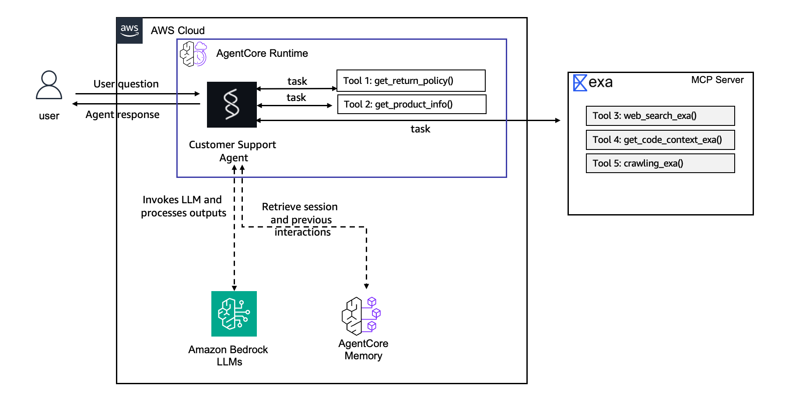

# Lab 2: Add Memory to Your Agent

**⏱️ Estimated time: ~20 minutes**

## [Overview](https://catalog.us-east-1.prod.workshops.aws/event/dashboard/en-US/workshop/30-lab2-memory#overview)

Your agent works, but every conversation starts from scratch. If a customer tells the agent their name and preferences today, it won't remember any of it tomorrow. That's fine for a demo, but useless for real support.

In this lab, you'll add [AgentCore Memory ](https://docs.aws.amazon.com/bedrock-agentcore/latest/devguide/memory.html) so your agent retains facts across sessions. After this lab, a returning customer gets recognized automatically without repeating themselves.

### [How AgentCore Memory works](https://catalog.us-east-1.prod.workshops.aws/event/dashboard/en-US/workshop/30-lab2-memory#how-agentcore-memory-works)

AgentCore Memory provides two types: **short-term memory** stores raw conversation events within a session, while **long-term memory** extracts and persists key insights across sessions. For long-term memory, AgentCore offers several built-in strategies (Semantic, Summarization, User Preference) as well as custom strategies where you supply your own extraction prompt. In this lab, we'll use two of the built-in strategies:

| Strategy | Purpose | What It Does |
| --- | --- | --- |
| **SEMANTIC** | Facts and context | Captures factual information from conversations (names, preferences, order details) and makes them retrievable across sessions |
| **SUMMARIZATION** | Conversation history | Compressed conversation summaries that provide continuity across sessions |

### Session Persistence vs. AgentCore Memory

Your agent can *already* "remember" things **within a single conversation**, even without this lab. As long as you reuse the same `--session-id`, AgentCore Runtime keeps that session's conversation context alive (you'll see this directly in Lab 4). That's **session persistence**, and it does **not** require AgentCore Memory.

What AgentCore Memory adds is durability *beyond* a single live session:

- **Across sessions** — a brand-new `session-id`, even days later, can still recall facts about the user.
- **Across runtime recycling** — AgentCore Runtime recycles idle microVMs after an inactivity timeout, which wipes the in-process conversation state. Memory persists the information so it survives the recycle.

That's why the test in Step 5 deliberately uses a **new `session-id`**: it proves the recall is coming from Memory, not from session persistence.

## [Step 1: Add Memory to Your Project](https://catalog.us-east-1.prod.workshops.aws/event/dashboard/en-US/workshop/30-lab2-memory#step-1:-add-memory-to-your-project)

If you still have the dev server running from Lab 1, stop it first by pressing `Esc` in the interactive TUI, or `Ctrl+C` if running in `--logs` mode.

Use the AgentCore CLI to add a memory resource. This single command configures both tiers: `--expiry 30` sets how long raw conversation events are retained in short-term memory (30 days), and `--strategies` enables long-term memory extraction using the strategies you specify:

**AgentCore CLI / Interactive**

**macOS/Linux / Windows**

```bash
agentcore add memory \
  --name SharedMemory \
  --strategies SEMANTIC,SUMMARIZATION \
  --expiry 30
```

You should see this output message:

```bash
Added memory 'SharedMemory'
```

This updates your `agentcore/agentcore.json` with the memory configuration. You can verify:

**macOS/Linux / Windows**

```bash
cat agentcore/agentcore.json
```

The `memories` array now contains your memory resource with SEMANTIC and SUMMARIZATION strategies, each with their own namespace patterns. Namespaces are path-like scopes (e.g., `/users/{actorId}/facts`) that control where extracted records are stored and retrieved. They use variable substitution so each user's memories are isolated automatically.

## [Step 2: Integrate Memory into Your Agent Code](https://catalog.us-east-1.prod.workshops.aws/event/dashboard/en-US/workshop/30-lab2-memory#step-2:-integrate-memory-into-your-agent-code)

The CLI creates the memory resource in the infrastructure, but you need to wire it into your agent code. In your Code Editor terminal, create the memory session manager:

**macOS/Linux / Windows**

```bash
mkdir -p app/CustomerSupport/memory
touch app/CustomerSupport/memory/__init__.py
touch app/CustomerSupport/memory/session.py
```

Open `app/CustomerSupport/memory/session.py` in the Code Editor and paste the following:

### What This Code Does

This module creates a memory session manager that connects your agent to AgentCore Memory. It configures two retrieval namespaces: one for user-specific facts (`/users/{actorId}/facts`) extracted by the SEMANTIC strategy, and one for conversation summaries (`/summaries/{actorId}/{sessionId}`) from the SUMMARIZATION strategy. The `MEMORY_SHAREDMEMORY_ID` environment variable is automatically injected by AgentCore Runtime after deployment.

```python
import os
from typing import Optional
from bedrock_agentcore.memory.integrations.strands.config import AgentCoreMemoryConfig, RetrievalConfig
from bedrock_agentcore.memory.integrations.strands.session_manager import AgentCoreMemorySessionManager

MEMORY_ID = os.getenv("MEMORY_SHAREDMEMORY_ID")
REGION = os.getenv("AWS_REGION")

def get_memory_session_manager(session_id: str, actor_id: str) -> Optional[AgentCoreMemorySessionManager]:
    if not MEMORY_ID:
        return None

    retrieval_config = {
        f"/users/{actor_id}/facts": RetrievalConfig(top_k=3, relevance_score=0.3),
        f"/summaries/{actor_id}/{session_id}": RetrievalConfig(top_k=3, relevance_score=0.3)
    }

    return AgentCoreMemorySessionManager(
        AgentCoreMemoryConfig(
            memory_id=MEMORY_ID,
            session_id=session_id,
            actor_id=actor_id,
            retrieval_config=retrieval_config,
        ),
        REGION
    )
```

**How it works:** The memory ID is injected as an environment variable (`MEMORY_SHAREDMEMORY_ID`) by the AgentCore Runtime after deployment. The session manager handles storing and retrieving memory records automatically.

## [Step 3: Update main.py to Use Memory](https://catalog.us-east-1.prod.workshops.aws/event/dashboard/en-US/workshop/30-lab2-memory#step-3:-update-main.py-to-use-memory)

Now replace the entire contents of `app/CustomerSupport/main.py` with the updated version below. This wires memory into your agent. The key changes from Lab 1 are:

- Import the memory session manager you just created
- Use a factory pattern to create agents per session/user
- Extract `session_id` and `user_id` from the runtime context

### What Changed from Lab 1

The main difference is the agent factory pattern. Instead of a single global agent, we now create one agent per session/user combination, each with its own `session_manager`. This allows the agent to store and retrieve memories scoped to each user. The `invoke` function now extracts `session_id` and `user_id` from the runtime context and passes them to the factory.

```python
from strands import Agent, tool
from bedrock_agentcore.runtime import BedrockAgentCoreApp
from model.load import load_model
from mcp_client.client import get_streamable_http_mcp_client
from memory.session import get_memory_session_manager

app = BedrockAgentCoreApp()
log = app.logger

# Exa AI MCP client for web search
mcp_clients = [get_streamable_http_mcp_client()]

SYSTEM_PROMPT="""You are a helpful and professional customer support assistant for an e-commerce company.
Your role is to:
- Provide accurate information using the tools available to you
- Be friendly, patient, and understanding with customers
- Always offer additional help after answering questions
- If you can't help with something, direct customers to the appropriate contact

You have access to tools for looking up return policies, searching product information, and more.
Additional tools may be available at runtime — always check your full tool list and use the most appropriate tool for each customer request.
Always use tools to get accurate, up-to-date information rather than guessing."""

# --- Customer Support Tools ---

RETURN_POLICIES = {
    "electronics": {"window": "30 days", "condition": "Original packaging required, must be unused or defective", "refund": "Full refund to original payment method"},
    "accessories": {"window": "14 days", "condition": "Must be in original packaging, unused", "refund": "Store credit or exchange"},
    "audio": {"window": "30 days", "condition": "Defective items only after 15 days", "refund": "Full refund within 15 days, replacement after"},
}

PRODUCTS = {
    "PROD-001": {"name": "Wireless Headphones", "price": 79.99, "category": "audio", "description": "Noise-cancelling Bluetooth headphones with 30h battery life", "warranty_months": 12},
    "PROD-002": {"name": "Smart Watch", "price": 249.99, "category": "electronics", "description": "Fitness tracker with heart rate monitor, GPS, and 5-day battery", "warranty_months": 24},
    "PROD-003": {"name": "Laptop Stand", "price": 39.99, "category": "accessories", "description": "Adjustable aluminum laptop stand for ergonomic desk setup", "warranty_months": 6},
    "PROD-004": {"name": "USB-C Hub", "price": 54.99, "category": "accessories", "description": "7-in-1 USB-C hub with HDMI, USB-A, SD card reader, and ethernet", "warranty_months": 12},
    "PROD-005": {"name": "Mechanical Keyboard", "price": 129.99, "category": "electronics", "description": "RGB mechanical keyboard with Cherry MX switches", "warranty_months": 24},
}

@tool
def get_return_policy(product_category: str) -> str:
    """Get return policy information for a specific product category.

    Args:
        product_category: Product category (e.g., 'electronics', 'accessories', 'audio')

    Returns:
        Formatted return policy details including timeframes and conditions
    """
    category = product_category.lower()
    if category in RETURN_POLICIES:
        policy = RETURN_POLICIES[category]
        return f"Return policy for {category}: Window: {policy['window']}, Condition: {policy['condition']}, Refund: {policy['refund']}"
    return f"No specific return policy found for '{product_category}'. Please contact support for details."

@tool
def get_product_info(query: str) -> str:
    """Search for product information by name, ID, or keyword.

    Args:
        query: Product name, ID (e.g., 'PROD-001'), or search keyword

    Returns:
        Product details including name, price, category, and description
    """
    query_lower = query.lower()
    # Search by ID
    if query.upper() in PRODUCTS:
        p = PRODUCTS[query.upper()]
        return f"{p['name']} ({query.upper()}): ${p['price']}, Category: {p['category']}, {p['description']}, Warranty: {p['warranty_months']} months"
    # Search by keyword
    results = [f"{pid}: {p['name']} - ${p['price']} - {p['description']}" for pid, p in PRODUCTS.items()
               if query_lower in p['name'].lower() or query_lower in p['description'].lower() or query_lower in p['category'].lower()]
    if results:
        return "Found products:\n" + "\n".join(results)
    return f"No products found matching '{query}'."

tools = [get_return_policy, get_product_info]

# Add MCP client (Exa AI web search) to tools
for mcp_client in mcp_clients:
    if mcp_client:
        tools.append(mcp_client)

# --- Agent Setup ---

_agent = None

def get_or_create_agent(session_id, user_id):
    global _agent
    if _agent is None:
        _agent = Agent(
            model=load_model(),
            session_manager=get_memory_session_manager(session_id, user_id),
            system_prompt=SYSTEM_PROMPT,
            tools=tools
        )
    return _agent


@app.entrypoint
async def invoke(payload, context):
    log.info("Invoking Agent.....")

    session_id = context.session_id
    user_id = context.request_headers['x-amzn-bedrock-agentcore-runtime-custom-user-id']

    if not session_id or not user_id:
        raise ValueError("session_id and user_id are required. Pass --session-id and --user-id when invoking.")

    agent = get_or_create_agent(session_id, user_id)
    stream = agent.stream_async(payload.get("prompt"))
    async for event in stream:
        if "data" in event and isinstance(event["data"], str):
            yield event["data"]


if __name__ == "__main__":
    app.run()
```

The user-id is retrieved from a custom header as shown in the above code. We need to allowlist the customer header in `agentcore.json`. Add below entry to the runtime config:

```json
"requestHeaderAllowlist": [
    "X-Amzn-Bedrock-AgentCore-Runtime-Custom-User-Id"
]
```

The runtime config in `agentcore.json` should look like:

```json
"runtimes": [
    {
        "name": "CustomerSupport",
        "build": "CodeZip",
        "entrypoint": "main.py",
        "codeLocation": "app/CustomerSupport/",
        "runtimeVersion": "PYTHON_3_14",
        "networkMode": "PUBLIC",
        "protocol": "HTTP",
        "requestHeaderAllowlist": [
            "X-Amzn-Bedrock-AgentCore-Runtime-Custom-User-Id"
        ]
    }
]
```

This is an important step before moving to the next step to make sure that the AgentCore Runtime understands the custom header once the agent is invoked. Ideally, once security is implemented, the `user-id` or `actor-id` should be retrieved from the authorization claims. We will see that behavior in Lab 4.

## [Step 4: Deploy to Enable Memory](https://catalog.us-east-1.prod.workshops.aws/event/dashboard/en-US/workshop/30-lab2-memory#step-4:-deploy-to-enable-memory)

Memory is a cloud service — it requires deployment to function.

Since you already deployed your agent in Lab 1, this redeployment will update your existing stack with the new memory resource:

```bash
agentcore deploy -y -v
```

You should see the memory resource being added to your existing deployment:

```bash
✓ Load deployment target
✓ Validate project
✓ Build CDK project
✓ Synthesize CloudFormation
✓ Deploy to AWS
  - AWS::IAM::Role (ExecutionRole)
  - AWS::BedrockAgentCore::Memory (SharedMemory)
  - AWS::BedrockAgentCore::Runtime (CustomerSupport) [updated]
✓ Persist deployment state

✓ Deployed to 'default'
```

> **Note:** Since your agent is already deployed, this update adds the memory resource and updates the runtime. Expect 2–5 minutes. The CLI detects the existing stack and only applies the changes.

That is it! You just deployed your AgentCore Memory and updated your agent code with the memory integration.

### Updated Architecture

That’s it! You have successfully deployed **AgentCore Memory** and updated your agent code to integrate memory.

Here is the updated architecture:


## [Step 5: Test Memory — Teach Your Agent About You](https://catalog.us-east-1.prod.workshops.aws/event/dashboard/en-US/workshop/30-lab2-memory#step-5:-test-memory-teach-your-agent-about-you)

Now let's test that memory works across sessions. Since the updated `main.py` expects a `session_id` and `user_id` on every invocation, we need to pass both:

- **`--session-id`** — A random UUID that identifies this conversation. Memory is scoped per session.
- **`-H "X-Amzn-Bedrock-AgentCore-Runtime-Custom-User-Id: Sarah"`** — The custom header (which we allowlisted in Step 3) that tells the agent *which user* is talking. Memory uses this to store and retrieve facts for that specific person. In Lab 4, this will come from the JWT token instead.

**macOS/Linux / Windows**

```bash
SESSION_A=$(python3 -c 'import uuid; print(uuid.uuid4())')
agentcore invoke "My name is Sarah and I prefer email updates. I recently bought a Smart Watch." \
  --session-id $SESSION_A \
  -H "X-Amzn-Bedrock-AgentCore-Runtime-Custom-User-Id: Sarah" --stream
```

Wait about 1-2 minutes for the memory extraction to process, then start a **completely new session** and ask. Running the same command with a different prompt works as a new random UUID will be created as session\_id. However, the user-id in the custom header is still Sarah:

**macOS/Linux / Windows**

```bash
sleep 2m
SESSION_B=$(python3 -c 'import uuid; print(uuid.uuid4())')
agentcore invoke "Do you know anything about me?" \
  --session-id $SESSION_B \
  -H "X-Amzn-Bedrock-AgentCore-Runtime-Custom-User-Id: Sarah" --stream
```

Expected response:

```bash
participant:~/workshop/CustomerSupport$ SESSION_A=$(python3 -c 'import uuid; print(uuid.uuid4())')
agentcore invoke "My name is Sarah and I prefer email updates. I recently bought a Smart Watch." \
  --session-id $SESSION_A \
  -H "X-Amzn-Bedrock-AgentCore-Runtime-Custom-User-Id: Sarah" --stream
Hi Sarah! Welcome, and thanks for reaching out! 😊 I'll keep in mind that you prefer email updates.

Let me pull up the product information for the Smart Watch right away!Great news, Sarah! Here's what we have on file for your Smart Watch:

- 🕐 **Product:** Smart Watch (PROD-002)
- 💰 **Price:** $249.99
- ✨ **Features:** Fitness tracker with heart rate monitor, GPS, and 5-day battery life

How can I help you with your Smart Watch today? Whether it's questions about **setup**, **features**, **returns**, or anything else — I'm here to help! And of course, I'll make sure any updates are sent to you via **email**. 📧

Session: 24a9f53e-161e-430f-b8e0-103fe7d19181
To resume: agentcore invoke --session-id 24a9f53e-161e-430f-b8e0-103fe7d19181
Log: /home/participant/workshop/CustomerSupport/agentcore/.cli/logs/invoke/invoke-CustomerSupport-20260822-202113.log
participant:~/workshop/CustomerSupport$ 
```

🎉 **The agent remembered you across sessions!** The `SEMANTIC` strategy automatically extracted facts from the first conversation and made them available in the second.

Here's what each strategy captured:

| What happened | Strategy | Result |
| --- | --- | --- |
| "My name is Sarah" | SEMANTIC | Extracted as fact: "The user's name is Sarah" |
| "I prefer email updates" | SEMANTIC | Extracted as fact: "Sarah prefers email updates" |
| Full conversation | SUMMARIZATION | Compressed summary stored for session continuity |

### Optional: Prove It Survives a Runtime Recycle

Recall inside one `session-id` alone doesn't prove Memory is doing the work — plain session persistence would give the same result. To isolate Memory, let the runtime go **idle long enough to be recycled** (leave it with no invocations for several minutes), then invoke again and ask *"What's my name?"* — using either a new `session-id` or the original one:

- **macOS/Linux**

```bash
SESSION_C=$(python3 -c 'import uuid; print(uuid.uuid4())')
agentcore invoke "What's my name and how do I like to be contacted?" \
  --session-id $SESSION_C \
  -H "X-Amzn-Bedrock-AgentCore-Runtime-Custom-User-Id: Sarah" --stream
```

**Response**

```powershell
participant:~/workshop/CustomerSupport$ SESSION_C=$(python3 -c 'import uuid; print(uuid.uuid4())')
agentcore invoke "What's my name and how do I like to be contacted?" \
  --session-id $SESSION_C \
  -H "X-Amzn-Bedrock-AgentCore-Runtime-Custom-User-Id: Sarah" --stream
Based on your profile, here's what I have on file for you:

- **Name:** Sarah
- **Preferred Contact Method:** Email updates

So whenever there are any updates — whether about your orders, promotions, or support responses — you'll receive them via email. 📧

Is there anything else I can help you with, Sarah? For instance, if you have any questions about your recent Smart Watch purchase, I'd be happy to assist! 😊

Session: a708926c-0d35-4b47-a886-af01b887e00e
To resume: agentcore invoke --session-id a708926c-0d35-4b47-a886-af01b887e00e
Log: /home/participant/workshop/CustomerSupport/agentcore/.cli/logs/invoke/invoke-CustomerSupport-20260822-203249.log
participant:~/workshop/CustomerSupport$ 
```


Without Memory, a recycled runtime would have lost all context and the agent wouldn't know you. With Memory, it still greets you as Sarah and recalls your email preference — because the facts live in AgentCore Memory, not in the runtime's process.

## [Congratulations! ✅](https://catalog.us-east-1.prod.workshops.aws/event/dashboard/en-US/workshop/30-lab2-memory#congratulations!)

Your agent now:

- Remembers customer facts across sessions using AgentCore Memory
- Extracts preferences automatically via the SEMANTIC strategy
- Maintains conversation continuity via SUMMARIZATION
- Personalizes responses without any manual context management

### [What's Next](https://catalog.us-east-1.prod.workshops.aws/event/dashboard/en-US/workshop/30-lab2-memory#what's-next)

Your agent remembers, but its tools are still local Python functions baked into `main.py`. What happens when another team already has useful business logic sitting in a Lambda function? You shouldn't have to copy their code into your agent.

In Lab 3, you'll expose an existing Lambda as an MCP-compatible tool through AgentCore Gateway, so your agent can discover and call it without owning the code.
